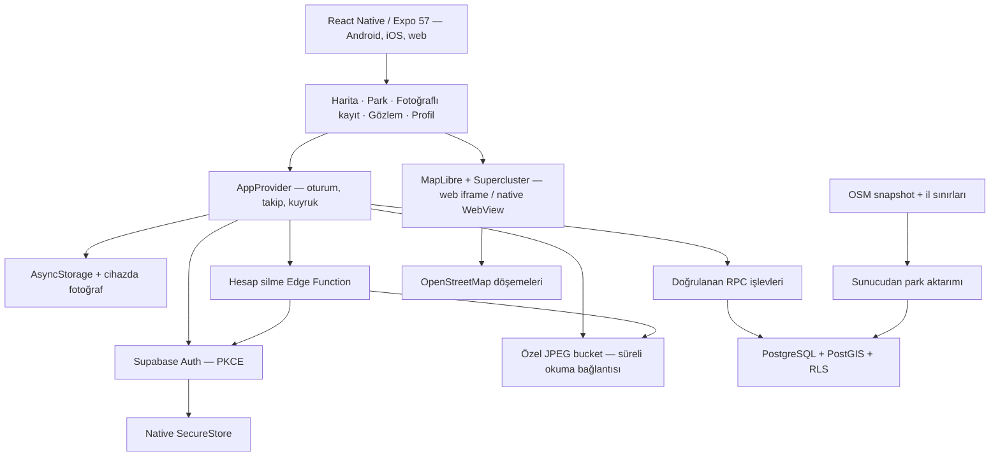
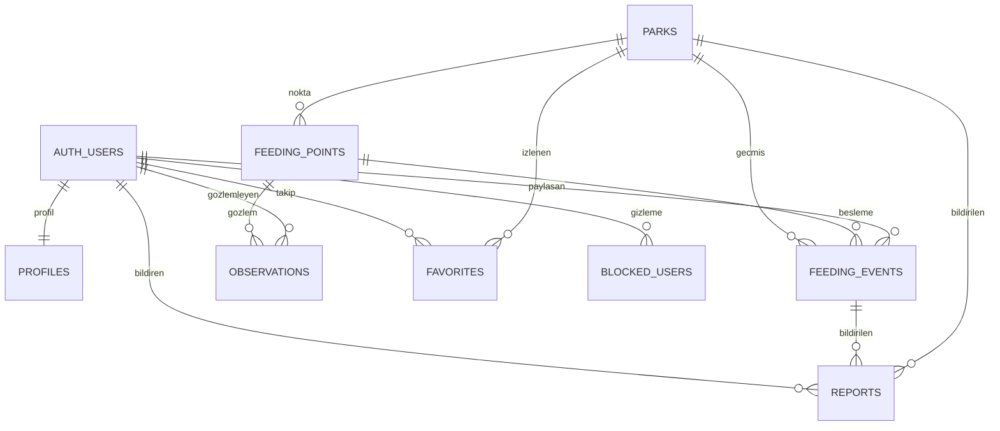

# Uygulama mimarisi

Ekranlar `src/screens`, ortak arayüz `src/ui`, iş kuralları `src/core`, dış servis erişimi `src/services`, uygulama durumu `src/state` içindedir. Root Next.js uygulaması mimari atlasıdır; mobil uygulama bağımsız `mobile/package.json` kullanır.

Fotoğraf JPEG'e dönüştürülür, en fazla 1280 piksel genişliğe indirilir; miktar, park/nokta ve fotoğraf birlikte doğrulanır. UUID işlem kimliği oluşturulur. Fotoğraf ve kayıt önce cihazdaki kullanıcıya ait kuyruğa yazılır; sonra özel Storage'a ve RPC'ye gönderilir. Yeniden deneme aynı kimliği kullanır. PostgreSQL sahiplik, miktar, nokta, zaman, fotoğraf yolu ve günlük sınır kontrolü yapar. Eski bir çevrimdışı kaydın gelmesi yeni “son besleme” bilgisini ezmez.

Kayıt gramajı kullanıcının beyanıdır. Fotoğraf otomatik doğrulanmaz; hayvanların açlık durumu veya kalan mama miktarı çıkarılmaz. “Son mama” ve “son su” ayrı olaylardan hesaplanır; 24 saati geçen kap gözlemi güncel kabul edilmez. Harita sorgusu en fazla 200 park, geçmiş sorgusu 30 kayıt döndürür. Sayfalama zaman + UUID kullanır. Park özetleri yalnızca seçilen en yakın 200 aday için hesaplanır.

API kullanan herkes parkları ve yayınlanmış beslemeleri okuyabilir. Fotoğrafı görmek ve paylaşmak için oturum gerekir. Kullanıcı kendi kaydını kaldırır; moderatör yetkisi sunucunun imzaladığı `app_metadata` üzerinden kontrol edilir. Hesap silme önce fotoğrafları, sonra hesabı ve bağlı kişisel kayıtları kaldırır. Hesap silme için sunucudaki yönetici anahtarı telefona ulaşmaz.

Demo modu aynı ekranları kullanır, gerçek parklar üzerindeki örnek kayıtları cihazda tutar. Demo ve canlı kuyrukları ayrı ad alanlarındadır. Supabase kurulunca canlı veriye örnek besleme aktarılmaz.
