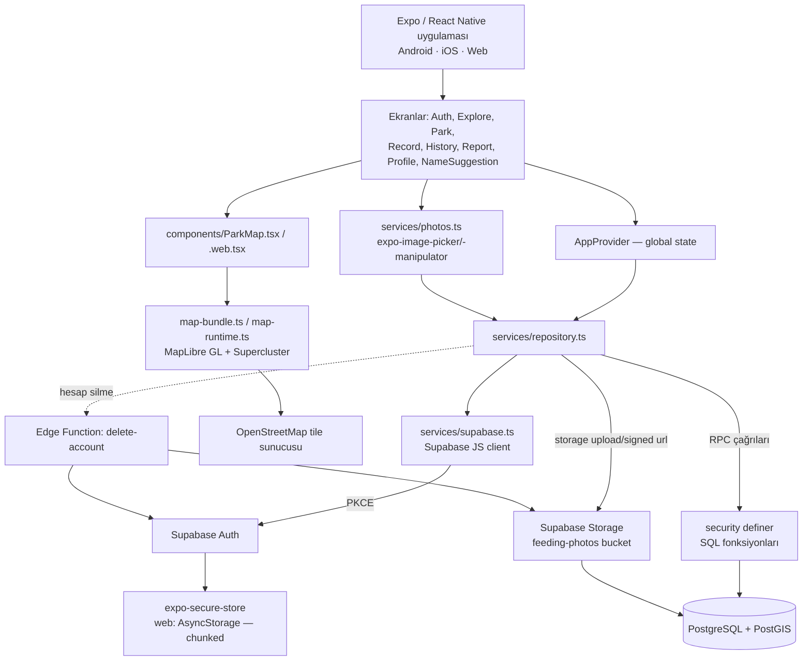
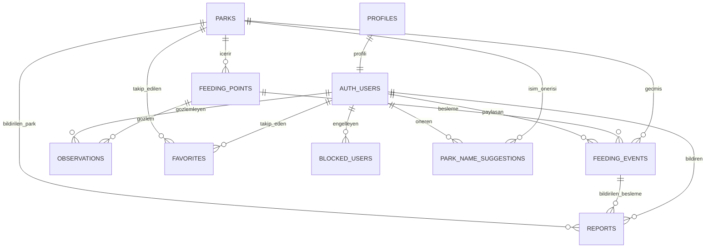
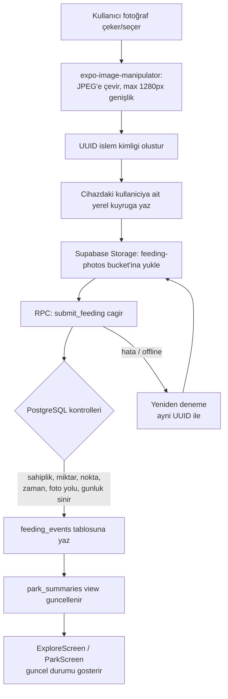

# Mevcut Sistem Mimarisi (Current State)

> Bu belge, `docs/requirements.md`'deki ürün/MVP vizyonundan **bağımsız** olarak, kod tabanında **şu anda gerçekten var olan** implementasyonu belgeler. Requirements ile karşılaştırma bölüm 14'tedir. Bu belge önerilen/planlanan bir mimari değildir; sadece dosyalardan doğrulanan mevcut durumdur.

## 1. Genel Bakış

Repoda iki bağımsız npm paketi var:

- **Kök dizin (`/`)** — Next.js 16 + React 19 uygulaması. **Bu ürünün kendisi değildir.** `src/app/page.tsx` tek route'lu, statik bir "mimari atlası" görselleştirme sayfası render eder (`src/components/architecture.tsx`, `src/lib/architecture.ts`). Sayfanın kendi footer'ında "mobil uygulamanın uygulanmış durumunu göstermez" notu bulunur. `src/` içinde API route, auth, DB, harita veya storage kodu **yoktur**.
- **`mobile/`** — React Native 0.86.3 + Expo ~57.0.22. Android/iOS/web hedefli asıl ürün. Tüm gerçek özellik kodu buradadır.
- **`supabase/`** — Backend: PostgreSQL 17 + PostGIS, RLS, RPC fonksiyonları, Storage, Auth, Deno Edge Functions.

Bu belgenin geri kalanı `mobile/` ve `supabase/`'i konu alır.

## 2. Sistem Mimarisi



## 3. Frontend/Mobile Yapısı

```
mobile/src/
  screens/     AuthScreen, ExploreScreen, ParkScreen, RecordScreen,
               HistoryScreen, ReportScreen, ProfileScreen,
               NameSuggestionScreen, ResetScreen
  components/  ParkCard, FeedingCard, ParkMap(.web), MapParkPreview,
               map-bundle.ts, map-runtime.ts, map-model.ts,
               map-boundaries.ts, map-document.ts
  services/    supabase.ts, repository.ts, photos.ts,
               location.ts(.web), park-names.ts
  core/        types.ts, domain.ts (+ statik veri: parks.json vb.)
  state/       AppProvider.tsx
  ui/          ortak bileşenler / tema
  navigation.ts  React Navigation (native-stack + bottom-tabs) route tipleri
```

Tüm ekranlar (150–500 satır aralığında) gerçek iş mantığı içerir; TODO/FIXME/placeholder işaretine rastlanmadı.

## 4. Backend Yapısı

Backend mantığı doğrudan tablo yazma izinleriyle değil, **`security definer` RPC fonksiyonları** ile kontrol edilir (tablolara doğrudan yazma yetkisi `revoke` edilmiş):

- `submit_feeding`, `submit_observation`, `remove_feeding`
- `suggest_park_name`, `review_park_name`
- `block_user`, `report_item`, `resolve_report`

Bunun dışında `parks`, `feeding_points`, yayınlanmış `feeding_events` gibi okuma işlemleri RLS policy'leri ile herkese (anon dahil) açık; `favorites`, `blocked_users`, `reports` yalnızca sahibi (veya moderatör) tarafından okunabilir. Moderatör yetkisi Supabase JWT `app_metadata.role` alanı üzerinden kontrol edilir (`is_moderator()`).

**Edge Function:** `supabase/functions/delete-account/index.ts` — bearer token doğrular, kullanıcının `feeding-photos` klasöründeki tüm dosyaları sayfalayarak siler, sonra `auth.admin.deleteUser` çağırır.

**Migration dosyaları:** `supabase/migrations/202609130001_patika.sql`, `202609130002_park_names.sql`.

## 5. Authentication

- Supabase Auth, email/password (PKCE flow). `enable_signup=true`, e-posta doğrulama kapalı (`config.toml`).
- Dış OAuth sağlayıcıları config'de tanımlı ama tümü `enabled=false`.
- Oturum saklama: native'de `expo-secure-store` üzerinde **parçalı (chunked)** saklama (SecureStore boyut limiti nedeniyle), web'de AsyncStorage (`mobile/src/services/supabase.ts`).
- Deep link redirect URL'leri: `patika://giris`, `patika://reset`.
- **Demo mod:** Supabase client kurulu değilse (`requireBackend()`), uygulama gerçek hesap oluşturmadan yerel/demo verilerle çalışır. Demo ve canlı veri ayrı ad alanlarında tutulur.

## 6. Database — Entity İlişkileri



Ana tablolar (kolon özetleri):

| Tablo | Önemli kolonlar |
|---|---|
| `profiles` | id (FK→auth.users), display_name, created_at |
| `parks` | id, osm_id (unique), name, city, district, lat/lng, `location` (PostGIS geography), active, name_status/name_source (migration 2) |
| `feeding_points` | id, park_id (FK), name, lat/lng, active |
| `feeding_events` | id, user_id (FK), point_id (FK), park_id (FK), food_type, food_grams, water_ml, note, photo_path (unique), occurred_at, received_at, status |
| `observations` | id, user_id (FK), point_id (FK), food_status, water_status, note, observed_at |
| `favorites` | user_id + park_id (composite PK) |
| `blocked_users` | user_id + blocked_id (composite PK) |
| `reports` | id, user_id (FK), feeding_id (FK, nullable), park_id (FK, nullable), reason, detail, status |
| `park_name_suggestions` | id, park_id (FK), user_id (FK), original_name, proposed_name, evidence, status, reviewed_by |
| `park_summaries` (view) | `parks` + en son feeding/observation verisinin birleşimi |

Fotoğraflar `feeding-photos` storage bucket'ında (max 5MB, sadece `image/jpeg`), kolon değil ama RLS kuralı ile ilişkilendirilir: kullanıcı yalnızca kendi `{uid}/...` klasörüne yazabilir.

## 7. Mevcut Veri Modelleri (TypeScript)

- `mobile/src/core/types.ts`, `mobile/src/core/domain.ts` — domain tipleri (Park, FeedingPoint, FeedingEvent, Observation vb.), DB şemasının TS karşılığı.
- Statik/demo veri: `mobile/src/core/parks.json`, `park-details.json` (demo mod için).
- ORM kullanılmıyor; erişim doğrudan Supabase JS client (`repository.ts`) üzerinden.

## 8. API Yapısı

Ayrı bir REST/GraphQL API yoktur. Tüm veri erişimi `mobile/src/services/repository.ts` üzerinden Supabase'e yapılır:

- **RPC çağrıları** (okuma): `get_parks`, `get_park`, `list_feedings`
- **RPC çağrıları** (yazma, madde 4'teki fonksiyonlar)
- **Doğrudan `.from()` sorguları**: örn. `feeding_points` okuma
- **Storage**: upload + `createSignedUrls` (fotoğraf için süreli okuma bağlantısı)

Next.js tarafında (`src/app`) hiçbir API route (`route.ts`) yoktur.

## 9. Harita Sistemi

- **Kütüphane:** MapLibre GL JS (`maplibre-gl: ^6.9.0`) + Supercluster (kümeleme).
- **Native (iOS/Android):** `components/ParkMap.tsx` haritayı bir `react-native-webview` içinde, `map-bundle.ts`'de bundle edilmiş HTML/JS enjekte ederek render eder.
- **Web:** Ayrı implementasyon `components/ParkMap.web.tsx`.
- Tile kaynağı OpenStreetMap.
- Kök dizindeki Next.js atlas sayfasında harita **soyut bir node olarak "sağlayıcı seçilecek"** notuyla gösterilir — bu, gerçek mobile implementasyonunu yansıtmaz, sadece atlas diyagramının kendi (eski/plan) içeriğidir.

## 10. Fotoğraf / Storage Sistemi

- `services/photos.ts`: `expo-image-picker` (kamera/galeri seçimi) → `expo-image-manipulator` (yeniden boyutlandırma + JPEG sıkıştırma) → `expo-file-system` (cihazda kalıcı yerel dosya).
- Yükleme: `repository.ts` üzerinden Supabase Storage `feeding-photos` bucket'ına.
- Erişim: imzalı URL (`createSignedUrls`) ile süreli okuma.
- İzinler: `app.config.ts` içinde CAMERA izni ve `expo-image-picker` plugin izin metinleri tanımlı.

## 11. Notification Sistemi

**Kodda mevcut değil.** `mobile/package.json`'da `expo-notifications` veya benzeri bir push notification bağımlılığı yok; ilgili herhangi bir kod bulunamadı. Kök dizindeki atlas diyagramında ve `docs/ARCHITECTURE.md`'de "Bildirim servisi — Expo Push → APNs/FCM" bir **plan/node** olarak yer alır, ama bu sadece tasarım notu; mobile kod tabanında karşılığı yoktur.

## 12. Temel Uygulama Veri Akışı (Besleme Kaydı)



Not: Bu akış `docs/ARCHITECTURE.md`'deki açıklamayla ve migration SQL'indeki kontrol mantığıyla uyumludur; ayrıca "eski bir çevrimdışı kaydın gelmesi yeni 'son besleme' bilgisini ezmemesi" kuralı `received_at`/`occurred_at` ayrımı üzerinden sağlanır.

## 13. Şu Anda Implement Edilmiş Temel Özellikler

- Kullanıcı kayıt/giriş/şifre sıfırlama (Supabase Auth)
- Harita üzerinde park ve besleme noktası gösterimi (MapLibre + clustering)
- Park detay ekranı: son mama/su/kontrol zamanı (`park_summaries`)
- Mama ve su yardımı kaydı (fotoğraflı, miktar bilgili)
- Fotoğraf çekme/seçme, sıkıştırma, storage'a yükleme, imzalı URL ile görüntüleme
- Geçmiş kayıtlar listesi (HistoryScreen)
- Gözlem kaydı (observation) — mama/su durumu kontrolü
- Favori parklar (takip)
- Kullanıcı engelleme, içerik/olay raporlama (moderasyon amaçlı `reports`)
- Park isim önerisi ve moderatör onay akışı (`park_name_suggestions`)
- Hesap silme (fotoğraflar + kullanıcı verisi + auth kaydı, Edge Function ile)
- Demo mod (backend olmadan yerel örnek verilerle kullanım)
- OSM tabanlı park kataloğu içe aktarma/zenginleştirme script'leri (`scripts/`, `data/`)

## 14. requirements.md ile Karşılaştırma

`docs/requirements.md` madde 9 (MVP kapsamı) esas alınarak:

| Requirements MVP kalemi | Kod tabanındaki durum |
|---|---|
| Kullanıcı kayıt sistemi | ✅ Var |
| Harita | ✅ Var |
| Parklar | ✅ Var |
| Parkların son yardım bilgileri | ✅ Var (`park_summaries`) |
| Mama yardımı kaydı | ✅ Var |
| Su yardımı kaydı | ✅ Var |
| Fotoğraf yükleme | ✅ Var |
| Konum doğrulama | ⚠️ Kısmi — konum kaydediliyor; GPS/park-mesafe doğrulamasının sunucu tarafında ayrı bir kural olarak uygulandığına dair kodda açık bir doğrulama bulunamadı |
| Basit puan sistemi | ❌ Yok — şemada puan/skor alanı veya tablo yok |
| Yaralı hayvan bildirimi (madde 5'teki durum akışı: Bildirildi → Doğrulanıyor → ... → Çözüldü) | ❌ Yok — `reports` tablosu var ama genel şikayet/moderasyon amaçlı; requirements'taki rescue-case durum makinesinin karşılığı değil |
| Veteriner noktaları | ❌ Yok — veteriner tablosu, ekranı veya haritada gösterimi bulunamadı |
| Basit leaderboard | ❌ Yok |

Ek olarak requirements'ta MVP dışı/ileri aşama olarak geçen ama kodda **var** olan:

- Favori parklar (madde 12) — ✅ implement edilmiş (`favorites` tablosu)
- Park isim önerisi/moderasyon — requirements'ta hiç geçmiyor, ama kodda bağımsız bir özellik olarak var

Requirements'ta MVP kapsamında olup kodda **hiç yer almayan**:

- Bildirim sistemi (madde 17)
- Oyunlaştırma / puan / leaderboard (madde 9, 13, 14)
- Veteriner ağı (madde 6)
- Yaralı hayvan / rescue-case akışı (madde 5)

**Genel değerlendirme:** Mevcut kod, requirements'ın "canlı yardım haritası + doğrulanabilir besleme kaydı + fotoğraf" çekirdeğini sağlam ve tutarlı şekilde uyguluyor; bu kısımda yarım kalmış/iskelet kod tespit edilmedi. Ancak requirements'ın MVP listesinde sayılan puan sistemi, leaderboard, veteriner noktaları ve yaralı hayvan bildirimi kodda **henüz hiç başlanmamış** durumda — bunlar "yarım" değil "yok".
