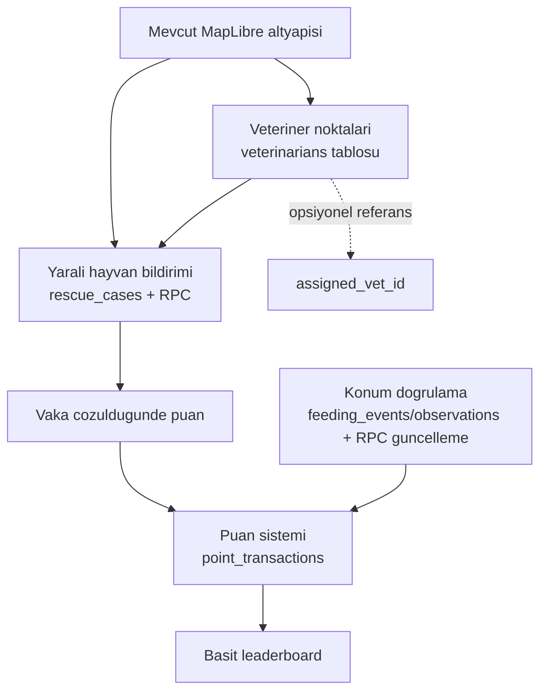
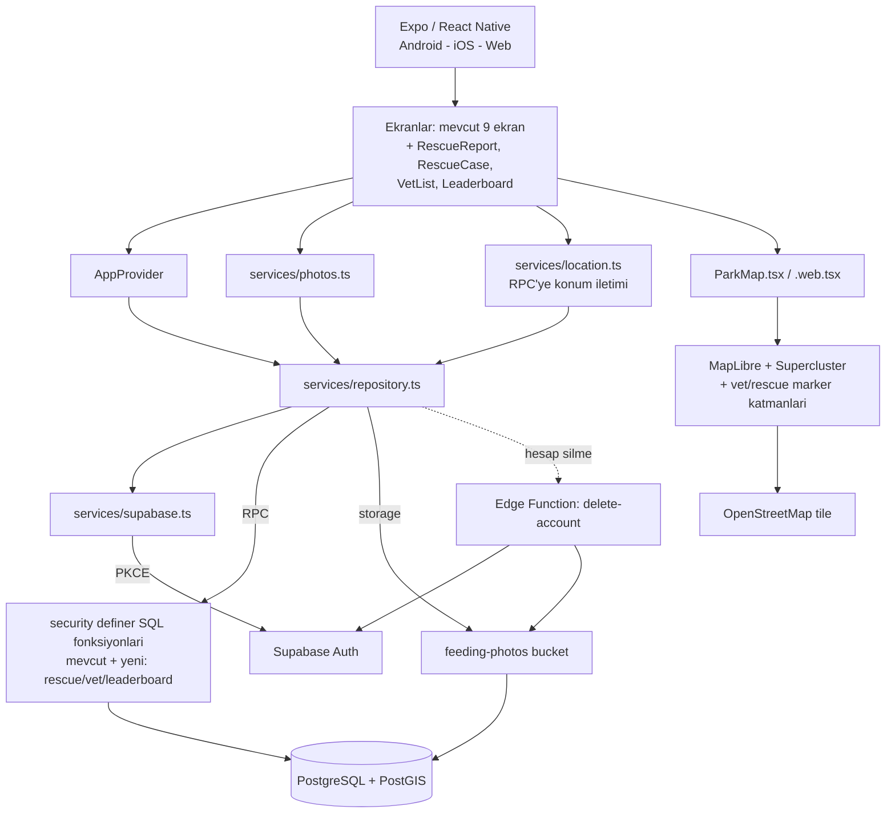
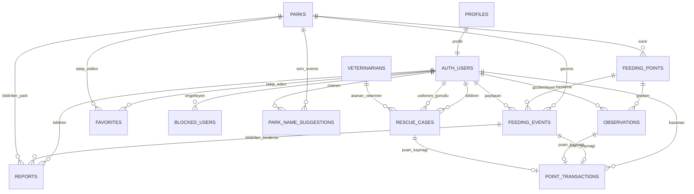

# Hedef MVP Mimarisi

> Bu belge yeni bir sistem tasarlamaz. `docs/current-architecture.md`'de belgelenen çalışan mimariyi (Expo/React Native + Supabase: PostgreSQL/PostGIS + RLS + `security definer` RPC + Storage) **korur** ve üzerine `docs/requirements.md` madde 9'daki MVP listesinde olup kodda henüz bulunmayan parçaları ekler. Amaç: minimum değişiklikle MVP'yi tamamlamak.

MVP dışı bırakılanlar (bilinçli olarak bu belgeye dahil edilmedi): bağış sistemi, Patika Mama, gelişmiş yapay zekâ/görüntü işleme doğrulama, belediye yönetim paneli, e-ticaret, rozet/seviye sistemleri, çoklu leaderboard kategorileri, QR kod sistemi, push notification. Bunlar `docs/requirements.md` madde 9 "İlk sürümde olmaması gerekenler" ile veya mevcut kodda zaten eksik olup MVP listesinde geçmeyen kalemlerle uyumlu şekilde sonraki aşamaya bırakıldı.

---

## 1. Mevcut Mimariden Korunacak Parçalar

Hiçbiri değiştirilmeyecek, aynen üzerine inşa edilecek:

- Expo/React Native uygulama iskeleti (`mobile/src/{screens,components,services,core,state,ui}`), navigation yapısı
- Supabase Auth (PKCE, chunked SecureStore/AsyncStorage), demo mod mantığı
- Veri erişim deseni: tüm yazma işlemleri `security definer` RPC fonksiyonları üzerinden, doğrudan tablo yazma izinleri kapalı
- Mevcut tablolar: `profiles`, `parks`, `feeding_points`, `feeding_events`, `observations`, `favorites`, `blocked_users`, `reports`, `park_name_suggestions`, view `park_summaries`
- Mevcut RPC'ler: `get_parks`, `get_park`, `list_feedings`, `submit_feeding`, `submit_observation`, `remove_feeding`, `block_user`, `report_item`, `resolve_report`, `suggest_park_name`, `review_park_name`
- Fotoğraf akışı: `expo-image-picker` → `expo-image-manipulator` → yerel kuyruk → `feeding-photos` bucket → RPC
- Harita altyapısı: MapLibre GL + Supercluster (native WebView / web ayrı implementasyon), OSM tile
- `delete-account` Edge Function
- OSM tabanlı park kataloğu import/zenginleştirme script'leri (`scripts/`, `data/`)

## 2. MVP İçin Eksik Bileşenler

`docs/requirements.md` madde 9 esas alınarak, kodda karşılığı olmayanlar:

| Eksik | requirements referansı |
|---|---|
| Konum doğrulama (sunucu tarafı GPS/mesafe kontrolü) | madde 3, 4 |
| Basit puan sistemi | madde 3, 9, 13 |
| Yaralı hayvan bildirimi + vaka durum akışı | madde 5 |
| Veteriner noktaları (harita + liste) | madde 6, 9 |
| Basit leaderboard | madde 9, 14 (tek kategori: en çok yardım yapanlar) |

## 3. Eklenmesi Gereken Veri Modelleri / Tablolar

Minimum ekleme prensibiyle, mevcut tablolara dokunmadan (yalnızca `feeding_events`/`observations`'a konum doğrulama için 2 kolon eklenecek):

**Yeni tablo — `veterinarians`**
`id, name, address, city, district, latitude, longitude, location (geography), phone, is_partner (bool), discount_info (text, nullable), active, created_at`

**Yeni tablo — `rescue_cases`**
`id, reporter_user_id (FK→auth.users), latitude, longitude, location (geography), description, animal_condition, photo_path, status (enum: reported/verifying/claimed/en_route/at_vet/treating/resolved), assigned_volunteer_id (FK→auth.users, nullable), assigned_vet_id (FK→veterinarians, nullable), created_at, updated_at`

**Yeni tablo — `point_transactions`**
`id, user_id (FK→auth.users), source_type (enum: feeding/observation/rescue_case), source_id (uuid), points (int), created_at`
- Basit leaderboard bu tablo üzerinden `SUM(points) GROUP BY user_id` ile hesaplanır (view: `leaderboard_summary`). Ayrı bir puan sütunu `profiles`'a eklenmez — mevcut tabloya dokunulmaz, tamamen additive.

**Mevcut tablolara ek kolonlar (minimum, additive):**
- `feeding_events`: `reported_latitude`, `reported_longitude` (kullanıcının kaydı yaparken bildirdiği GPS konumu; sunucu bunu `feeding_points.location` ile PostGIS `ST_DWithin` kıyaslar)
- `observations`: aynı iki kolon, aynı amaçla

## 4. Gerekli Backend Değişiklikleri

Yeni migration dosyası (mevcut migration'lar değiştirilmez, yenisi eklenir):

- Yukarıdaki 3 yeni tablo + 2 kolon eklemesi
- RLS: `veterinarians` herkese okunur (aktif olanlar); `rescue_cases` herkese okunur (moderasyon/gizlilik gerektiren alan yoksa), yazma yalnızca RPC üzerinden; `point_transactions` yalnızca sahibi okuyabilir, `leaderboard_summary` view herkese açık (sadece display_name + toplam puan)
- Yeni RPC fonksiyonları (mevcut desenle aynı: `security definer`, tablo yazma izni `revoke`):
  - `report_rescue_case(lat, lng, description, animal_condition, photo_path)`
  - `claim_rescue_case(case_id)` — durumu `claimed` yapar, `assigned_volunteer_id` atar
  - `update_rescue_case_status(case_id, new_status)` — yalnızca atanan gönüllü/moderatör
  - `get_rescue_cases()` — harita için aktif vakalar
  - `get_vets()` — aktif veteriner listesi
  - `get_leaderboard()` — `leaderboard_summary` view'dan okuma
- Mevcut `submit_feeding` ve `submit_observation` RPC'lerinin genişletilmesi (yeni fonksiyon değil, mevcut fonksiyonun içine ek mantık):
  1. Parametre olarak `reported_latitude`/`reported_longitude` al
  2. `ST_DWithin(feeding_points.location, reported_point, <eşik_metre>)` kontrolü yap; eşik dışındaysa kaydı reddet veya `status='flagged'` olarak işaretle (ürün kararı — bkz. Açık Sorular)
  3. Başarılı kayıttan sonra `point_transactions`'a satır ekle (sabit puan değeri, örn. besleme=10, gözlem=2)
- `rescue_case` çözüldüğünde (`update_rescue_case_status` → `resolved`) atanan gönüllüye `point_transactions` satırı eklenir

## 5. Gerekli Mobile/Frontend Değişiklikleri

Mevcut ekran/servis deseni korunur, yeni ekranlar aynı yapıya eklenir:

- `services/repository.ts`: yeni RPC çağrıları için fonksiyonlar (`reportRescueCase`, `claimRescueCase`, `updateRescueCaseStatus`, `getRescueCases`, `getVets`, `getLeaderboard`), `submitFeeding`/`submitObservation` çağrılarına konum parametresi eklenmesi
- `services/location.ts(.web)`: zaten var — besleme/gözlem kaydı sırasında cihaz GPS konumunun okunup RPC'ye iletilmesi (muhtemelen kısmen kullanılıyor, RPC'ye bağlanması gerekiyor)
- Yeni ekranlar:
  - `RescueReportScreen` — fotoğraf + konum + açıklama ile yaralı hayvan bildirimi (mevcut `RecordScreen`/`ReportScreen` deseniyle aynı iskelet)
  - `RescueCaseScreen` — vaka detay + durum güncelleme + "vakayı üstlen" butonu
  - `VetListScreen` (veya `ExploreScreen` içine filtre) — veteriner listesi/haritada gösterim
  - `LeaderboardScreen` — basit sıralı liste (kullanıcı adı + toplam puan)
- `components/ParkMap.tsx` / `.web.tsx` + `map-model.ts`: yeni marker tipleri (veteriner 🏥, aktif rescue case 🚨) — mevcut clustering altyapısına yeni veri katmanı olarak eklenir, harita motoru değişmez
- `ProfileScreen`: kullanıcının toplam puanını göstermek için `getLeaderboard`/kullanıcıya özel puan sorgusu entegrasyonu
- `navigation.ts`: yeni route tipleri (`RescueReport`, `RescueCase`, `VetList`, `Leaderboard`)

## 6. Feature Bağımlılıkları

Notlar:
- **Veteriner noktaları** bağımsız eklenebilir; `rescue_cases.assigned_vet_id` için referans olması dışında hiçbir şeye bağımlı değil, en erken teslim edilebilir parça.
- **Konum doğrulama** puan sisteminin ön koşulu değil ama önerilir (madde 4'teki sahte kayıt riskini azaltmak için); puan sistemi teknik olarak konum doğrulaması olmadan da çalışır.
- **Puan sistemi**, hem besleme/gözlem hem de çözülen rescue-case'lerden beslendiği için rescue-case akışından sonra (veya paralel, puan kaynağı ilk aşamada sadece feeding/observation ile sınırlı tutulup rescue-case entegrasyonu ikinci adımda eklenebilir).
- **Leaderboard**, point_transactions dolmadan anlamsız olacağından en son sırada.

## 7. Mermaid — Hedef Sistem Mimarisi

## 8. Mermaid — Hedef ER Diagram

## 9. Mevcut Sistem → Hedef MVP Arasındaki Farklar

| Alan | Mevcut | Hedef MVP |
|---|---|---|
| Tablolar | 9 tablo + 1 view | +3 yeni tablo (`veterinarians`, `rescue_cases`, `point_transactions`), 2 tabloya 2'şer kolon eklenmesi |
| RPC sayısı | 10 | +6 yeni RPC, 2 mevcut RPC'de genişletme (konum parametresi + puan yazma) |
| Konum doğrulama | Konum kaydediliyor, sunucu tarafı mesafe kontrolü yok | `ST_DWithin` ile RPC içinde doğrulama |
| Puanlama | Yok | `point_transactions` + sabit puan kuralları |
| Leaderboard | Yok | Tek kategori, `leaderboard_summary` view |
| Veteriner | Yok | `veterinarians` tablosu + harita/list ekranı |
| Yaralı hayvan bildirimi | Yok (yalnızca genel `reports` var, amaç farklı) | `rescue_cases` + durum akışı + 2 yeni ekran |
| Harita marker tipleri | Park / besleme noktası | + veteriner, + aktif rescue case |
| Mimari desen (RPC/RLS/Storage) | — | **Değişmiyor** |
| Mobile klasör yapısı | — | **Değişmiyor**, sadece yeni dosyalar ekleniyor |
| Notification, bağış, AI doğrulama, belediye paneli | Yok | Bu belgenin kapsamı dışında, sonraki aşama |

## Açık Sorular (implementasyon öncesi netleştirilmeli)

- Konum doğrulama eşiği (kaç metre) ve eşik dışı kayıtların davranışı: reddet mi, `flagged` statüsüyle moderasyona mı düşsün?
- Puan değerleri (besleme, gözlem, çözülen rescue-case için kaç puan) — requirements'ta net sayı verilmemiş, ürün kararı gerekiyor.
- `rescue_cases` için görünürlük kuralı: herkes mi görsün, yoksa yalnızca "doğrulanmış gönüllüler" mi (requirements madde 5'te bahsediliyor ama kodda "doğrulanmış gönüllü" rolü/mekanizması henüz yok — bu MVP'de basitleştirilip herkese açık tutulabilir veya `is_moderator()` benzeri bir `is_verified_volunteer()` eklenmesi gerekebilir; ikinci seçenek kapsam genişletir).

---

## Önerilen Geliştirme Sırası

1. **Veteriner noktaları** — bağımsız, en düşük riskli; yeni tablo + `get_vets` RPC + harita marker + basit liste ekranı.
2. **Konum doğrulama** — mevcut `submit_feeding`/`submit_observation` RPC'lerine `reported_latitude/longitude` parametresi ve `ST_DWithin` kontrolü; `location.ts` servisinin RPC çağrısına bağlanması.
3. **Basit puan sistemi** — `point_transactions` tablosu; adım 2'deki RPC'lere puan yazma mantığının eklenmesi (feeding/observation için).
4. **Yaralı hayvan bildirimi (rescue case)** — `rescue_cases` tablosu, `report_rescue_case`/`claim_rescue_case`/`update_rescue_case_status`/`get_rescue_cases` RPC'leri, `RescueReportScreen` + `RescueCaseScreen`, harita marker'ı; çözüldüğünde `point_transactions`'a yazma (adım 3'e bağımlı).
5. **Basit leaderboard** — `leaderboard_summary` view + `get_leaderboard` RPC + `LeaderboardScreen` (adım 3 ve 4'ün veri ürettiği duruma bağımlı, bu yüzden en son).

Bu sıra, her adımın bir önceki adımın üzerine bağımsız test edilebilir şekilde eklenmesini sağlar ve mevcut mimariye (RPC/RLS deseni, ekran/servis yapısı, harita altyapısı) hiçbir noktada dokunmaz.
